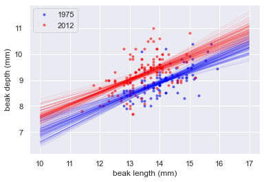

# 🐧 EDA of beak depths of Darwin's finches - Case Study
Study how the beak depth (the distance, top to bottom, of a closed beak) of the finch species **Geospiza scandens** has changed over time. The Grants have noticed some changes of beak geometry depending on the types of seeds available on the island, and they also noticed that there was some interbreeding with another major species on Daphne Major, **Geospiza fortis**. These effects can lead to changes in the species over time.

In the next few problems, we will look at the beak depth of **G. scandens** on Daphne Major in 1975 and in 2012. To start with, let's plot all of the beak depth measurements in 1975 and 2012 in a bee swarm plot. 

## 🤔 How to use this project

To get started just open the notebook.ipynb using jupyter notebook or any other equivalent

NOTE: You need to also download the datasets folder in order for project to work 

## 💁 What You're Getting
```bash
├── Case Study.ipynb
├── images.png
├── README.md
```

## 📸 Visualizations from the Project


<br/>


<br/>


<br/>


<br/>


<br/>


<br/>